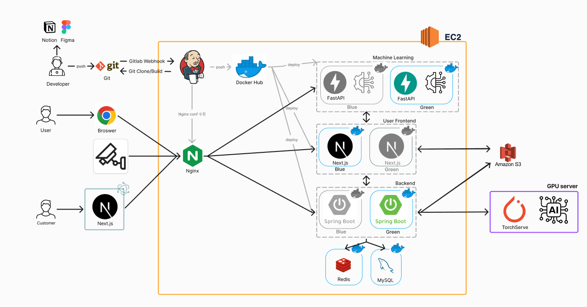

#  Auto Store Project : 무인 매장 관리 시스템  

# 목차
- [📌 프로젝트 소개](#-Automatic-Store-프로젝트-소개)
- [🤖 AI 기술](#-AI-기술)
- [# AI 외 기능](#-AI-외-기능)
- [👥 팀 소개](#-팀-소개)
- [⏱ 개발 기간](#-개발-기간)
- [📅 개선 일지](#-개선-일지)
- [🛠️ 기술 스택](#-기술-스택)
- [🎋 브랜치 전략](#-브랜치-전략)
- [📜 커밋 컨벤션](#-커밋-컨벤션)
- [📄 프로젝트 구조](#-프로젝트-구조)
- [🌐 포팅 매뉴얼](#-포팅-매뉴얼) 
- [💻 서비스 화면](#-서비스-화면)
- [📝 프로젝트 후기](#-프로젝트-후기 )

 

- 배포 URL :http://j11a302.p.ssafy.io/
- Test ID : test@naver.com
- Test PW : asdfasdf12

 

## 주요 요소

### 📷 AI 매장 이상 감지(도난, 파손, 실신, 방화, 흡연연) 

### 📑 상품 수요 예측(Machine Learning)

### 🖥️ Kiosk 서비스

### 📋 재고 관리(Order Fulfillment)

### 🖥 물류 정보 시스템(Logistics Information Systems)

 

# 📌 Auto Store 프로젝트 소개

Auto Store는 무인 매장의 사장님이 원격으로 매장을 관리할 수 있도록 설계된 프로젝트입니다. 또한 AI를 활용해 매장의 이상 현상을 감지하고, 과거의 판매 데이터를 분석하여 미래 수요를 예측함으로써 발주 시기를 최적화합니다.

# 🤖 AI 기술

### 📷 이상 감지 시스템 (Anomaly Detection)
- CCTV 영상 데이터를 실시간으로 분석하여 도난, 파손, 실신, 방화, 흡연 등의 이상 행동을 감지합니다.
- **TorchServe**를 통해 학습된 AI 모델을 배포하고 GPU 서버를 사용하여 고성능으로 영상 데이터를 처리합니다.
- 감지된 이상 현상은 즉시 사장님에게 알림을 보내어 빠르게 대처할 수 있도록 지원합니다.

### 📊 판매 데이터 분석 및 수요 예측
- 시계열 판매 데이터를 기반으로 **FastAPI**와 연동된 머신러닝 모델이 미래 수요를 예측합니다.
- 과거 판매 패턴을 분석하여 최적의 발주 시기를 제안하고, 안전 재고를 유지할 수 있도록 도와줍니다.
- 예측 모델은 지속적으로 데이터를 학습하여 점점 더 정확한 예측을 제공합니다.

### 🔍 AI 모델 학습 및 배포
- **TorchServe**와 **Amazon S3**를 이용하여 AI 모델을 효율적으로 학습하고 배포합니다.
- 모델 학습 과정은 GPU 서버에서 병렬 처리되어 빠르게 진행되며, 학습된 모델은 실시간으로 배포되어 매장 운영에 반영됩니다.
- 이상 현상 감지 및 수요 예측 외에도 추가적인 AI 기능 확장을 고려하여 확장 가능한 아키텍처로 설계되었습니다.

### 💡 AI의 장점
- **실시간 처리**: CCTV 및 판매 데이터를 실시간으로 분석하여 즉각적인 대응이 가능.
- **예측성**: 판매 데이터의 예측을 통해 재고 관리 및 발주 주기를 최적화하여 비용 절감.
- **확장 가능성**: TorchServe 및 FastAPI 기반의 AI 시스템으로, 다른 매장 데이터에도 적용 가능하며 모델 확장 용이.

# AI 외 기능

### 🖥️ Kiosk 서비스
- exe 파일로 매장의 키오스크를 관리 할 수 있습니다. 
- OTP와 JWT 토큰을 활용하여 매장의 보안을 강화합니다. 

### 📋 재고 관리
- PWA를 활용하여 사장님은 모바일 폰으로 언제든지 매장의 재고 수량을 확인 할 수 있습니다.
- 선반의 재고가 부족한 것을 실시간으로 확인 가능합니다.

# AUTO STORE 의 가치

 **저비용**: 최소한의 비용으로 무인 매장을 관리합니다. 불필요한 인력과 관리 비용을 줄이고, 효율적인 재고 관리와 AI 기반 예측 기능을 통해 운영 비용을 절감할 수 있습니다.
  
- **안전성**: AI를 활용한 CCTV 이상 감지 시스템과 보안 강화 기능으로 매장의 안전성을 극대화합니다. 실시간으로 이상 상황을 감지하고 즉시 알림을 제공해 불필요한 손실을 방지합니다.

- **예측성**: 과거의 판매 데이터를 분석하여 미래의 수요를 예측합니다. 이를 통해 발주 시기를 최적화하고, 재고 과잉이나 부족을 예방하여 매장 운영을 더 원활하게 합니다.

- **편리성**: PWA 기반으로 사장님이 언제 어디서든 모바일을 통해 재고를 확인하고 매장을 관리할 수 있으며, Kiosk 서비스를 통해 매장을 원격으로 제어할 수 있습니다.

 

# 👥 팀 소개

<table align="center">
  <tr>
    <tr align="center">
        <td style="min-width: 250px;">
            <a href="https://github.com/yuseok01">
              <b>김유석</b>
            </a>
        </td>
        <td style="min-width: 250px;">
            <a href="https://github.com/solmysoul1">
              <b>이한솔</b>
            </a> 
        </td>
        <td style="min-width: 250px;">
            <a href="https://github.com/hyeonjong-kim">
              <b>이수완</b>
            </a>
        </td>
    </tr>
    <tr align="center">
        <td style="min-width: 250px;">
              
        </td>
        <td style="min-width: 250px;">
              
        </td>
        <td style="min-width: 250px;">
              
        </td>
    </tr>
    <tr align="center">
        <td>
        <b>Team Leader  Project Manager</b><b> Frontend </b>Kiosk
        </td>
        <td>
        <b>Backend</b> Frontend 웹 사이트 디자인 총괄 User Service 구현 
        </td>
        <td>
        <b>Frontend</b> 창고 관리 주요 기능 구현 발표 및 영상 
        </td>
    </tr>
  <tr>
    <tr align="center">
        <td style="min-width: 250px;">
           <a href="https://github.com/seoyoung059">
              <b>김서영</b>
            </a>
        </td>
        <td style="min-width: 250px;">
            <a href="https://github.com/pv104">
              <b>김준혁</b>
            </a>
        </td>
        <td style="min-width: 250px;">
           <a href="https://github.com/whereisawedhii">
              <b>문재성</b>
            </a> 
        </td>
    </tr>
    <tr align="center">
        <td style="min-width: 250px;">
              
        </td>
        <td style="min-width: 250px;">
              
        </td>
        <td style="min-width: 250px;">
               
        </td>
    </tr>
    <tr align="center">
        <td>
        <b>Backend Leader, Infra</b> CI/CD 및 배포환경 구축 비즈니스 로직 구현 
        백엔드 성능개선 작업 
        </td>
        <td>
        <b>Backend</b> 상품 이동 재고 압축 리팩토링 
        </td>
        <td>
        <b>Backend</b> 상품 입고 및 출고 출고 최적화 백엔드 코드 리팩토링
        </td>
    </tr>
</table>

# ⏱ 개발 기간

- 2024-09-19 ~ 2024-10-10 (8주)
 

# 📅 개선 일지

### 2024년 9월 22일
- **JWT AccessToken, RefreshToken 도입 및 Redis 사용**
  - Spring Security 필터를 사용하여 토큰 인증을 수행하고, RefreshToken을 도입하여 Redis로 관리함으로써 보안을 강화.
  - User와 디바이스(키오스크, 카메라) 역할을 분리하여 결제 보안 프로세스를 추가.
  
### 2024년 9월 29일
- **AI 학습 성과 요약**
  - SlowFast 모델: Epoch 1에서 79% 정확도 → Epoch 6에서 92% 도달
  - X3D 모델: Epoch 1에서 81% 정확도 → Epoch 10에서 95% 도달
  - TorchServe 앙상블 서빙으로 AI 모델의 예측 견고성 강화.
  - 부하 테스트: 스레드 50개와 10개 영상 파일 동시 처리, 안정성 검증 완료.

### 2024년 10월 1일
- **api 효율성 증대**
  - 기존에 여러 API 호출이 필요한 동작을 개선하여 한 번의 요청으로 bulk save, update, delete가 가능하도록 구현.
  - 매장 및 매장 구조에서 API 효율성 개선.
  
### 2024년 10월 5일
- **Infra 개선**
  - 블루/그린 무중단 배포를 통해 서비스 중단 없이 배포 과정 진행 가능.
  - Jenkins Pipeline에서 Nginx의 `conf` 파일을 수정하여 트래픽 전환과 충돌 방지를 자동화.
  - 각 서비스(프론트엔드, 백엔드, 머신러닝)의 파이프라인을 도입하여 각각의 빌드 및 배포 과정 자동화.
  - 프론트엔드 빌드 약 7분, 백엔드 및 ML 빌드 약 1분으로 효율적인 배포를 가능하게 함.

 

 
# 🛠️ 기술 스택

##### 📱 Frontend

##### 🖥️ Frontend(Kiosk)

##### 🔗 npm 패키지

##### 💻 Backend

##### 🤖 AI/ML 기술

##### 🚀 Infra

##### ⚙️ Management Tools

##### 🖥️ IDE

# 🎋 브랜치 전략

# 📜 커밋 컨벤션
> **태그**: 제목의 형태이며 ':' 뒤에만 space가 있음에 유의한다.
- **`feat`**: 새로운 기능 추가
- **`fix`**: 버그 수정
- **`docs`**: 문서 수정
- **`style`**: 코드 포맷팅, 세미콜론 누락
- **`refactor`**: 코드 리팩토링
- **`test`**: 테스트 코드 작성 및 수정
- **`chore`**: 빌드 업무 수정, 패키지 매니저 수정
 

# 📄 프로젝트 구조

 

# 🌐 포팅 매뉴얼

[포팅 매뉴얼 보러 가기](https://whereisawedhi.notion.site/Auto-store-6eee2d733145412788c738e4fade9307?pvs=4)
 

# 💻 서비스 화면

|                                     |                                      |
|-------------------------------------|--------------------------------------|

 

 

# 📝 프로젝트 후기

### 김유석

 
    
### 김서영

 

### 김준혁

 

### 문재성

 

### 이한솔

 

### 이수완
